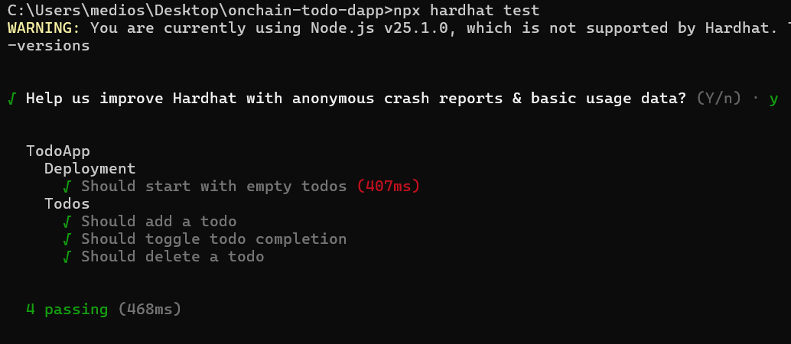

# On-Chain Todo dApp 📝

A decentralized Todo application built on the Ethereum blockchain (Sepolia Testnet). Users can add, toggle, and delete todos, with all data stored securely on-chain.

## 🚀 Features

-   **Decentralized Storage:** Todos are stored on the Ethereum blockchain.
-   **User Ownership:** Each user has their own private list of todos.
-   **Wallet Connection:** Secure login with MetaMask.
-   **Real-time Updates:** Instant UI reflection of blockchain transactions.
-   **Network Awareness:** Automatically prompts to switch to Sepolia Testnet.
-   **Persistence:** Remembers your wallet connection across sessions.

## 🛠 Tech Stack

-   **Smart Contract:** Solidity (v0.8.28)
-   **Blockchain Framework:** Hardhat
-   **Frontend:** Next.js (App Router), React
-   **Styling:** Tailwind CSS, Lucide React
-   **Interaction:** Ethers.js v6

## 📦 Installation

1.  **Clone the repository:**
    ```bash
    git clone https://github.com/your-username/onchain-todo-dapp.git
    cd onchain-todo-dapp
    ```

2.  **Install dependencies (Root):**
    ```bash
    npm install
    ```

3.  **Install dependencies (Frontend):**
    ```bash
    cd frontend
    npm install
    ```

4.  **Environment Setup:**
    Create a `.env` file in the root directory:
    ```env
    SEPOLIA_URL=https://sepolia.infura.io/v3/YOUR_INFURA_KEY
    PRIVATE_KEY=YOUR_WALLET_PRIVATE_KEY
    ```

## 🧪 Running Tests

Run the Hardhat unit tests to verify smart contract logic:

```bash
npx hardhat test
```

### Test Screenshot


## 🌍 Deployment

To deploy the smart contract to the Sepolia Testnet:

```bash
npx hardhat run scripts/deploy.js --network sepolia
```

After deployment, update the `CONTRACT_ADDRESS` in `frontend/utils/contract.js`.

## 🖥 Running the Frontend

1.  Navigate to the frontend directory:
    ```bash
    cd frontend
    ```

2.  Start the development server:
    ```bash
    npm run dev
    ```

3.  Open [http://localhost:3000](http://localhost:3000) in your browser.

## 🔗 Live Demo

[Live Demo Link](https://onchain-todo-dapp.vercel.app)

## 🎥 Demo Video

https://github.com/user-attachments/assets/98840d16-9296-4628-a24b-bdd89d915444


---

**Note:** This dApp runs on the **Sepolia Testnet**. You will need Sepolia ETH to interact with it. Get free testnet ETH from a [Sepolia Faucet](https://sepoliafaucet.com/).
